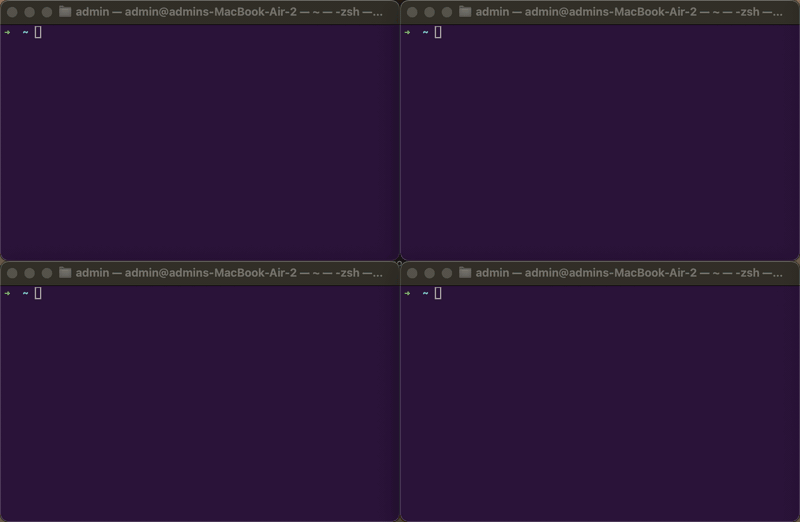

# termcolor

Give every macOS Terminal tab its own background color — automatically, keyed to the folder you're in.

Working in five checkouts of the same repo? Each one gets its own stable color, so you can tell your terminals apart at a glance. `cd` somewhere else and the tab recolors instantly.



- **Same folder → same color.** Colors come from a hash of the directory path, so they're stable across tabs, restarts, and days.
- **Per folder, always.** The key is the directory itself — never the repo root — so subdirectories of the same project each get their own color.
- **Live.** A `chpwd` hook recolors the tab on every `cd`, in the background — zero prompt latency.
- **Light and dark.** Every tab follows the system appearance the moment it changes: deep colors on dark, the same hue rendered pale on light, so black text stays readable. Nothing to configure.
- **Pinnable.** Want `project-a` always green and `project-b` always red? Pin exact colors in an overrides file.
- **Zero dependencies.** One zsh script driving Terminal.app over AppleScript. No brew, no polling.

## Install

```sh
curl -fsSL https://raw.githubusercontent.com/janwilmake/termcolor/main/install.sh | sh
```

This copies `termcolor` to `~/.local/bin`, appends a marker-guarded hook to your `~/.zshrc` (safe to re-run; it won't duplicate), and loads a launch agent that repaints your tabs when the system appearance changes. Then open a new tab.

Or manually: clone the repo, run `./install.sh`.

**Requirements:** macOS with the built-in Terminal.app and zsh (the default shell). iTerm2 is not supported — it has its own escape codes for this.

## Usage

The automatic coloring just works after install. The CLI is there when you want control:

```sh
termcolor list        # show named presets
termcolor ocean       # apply a preset to this tab
termcolor 40 10 30    # custom background, 0-255 per channel
termcolor auto        # color from the current directory (what the hook runs)
termcolor hue 210     # an exact hue on the wheel, rendered for this theme
termcolor random      # random background
termcolor reset       # restore the tab's profile colors
termcolor refresh     # repaint every known tab for the current appearance
```

Presets: `midnight`, `ocean`, `forest`, `wine`, `plum`, `ember`, `slate`, `black`. Only the background changes; the profile's own text color is left alone.

`hue` is for scripts that open several windows at once and want them all telling apart. Hashing can't promise that — eight hashed paths will sometimes put two of them within a few degrees of each other — so space the hues yourself: window `i` of `n` gets `termcolor hue $(( i * 360 / n ))`. That's what [multiclaude](https://github.com/janwilmake/multiclaude) does for its agent windows.

## Light and dark mode

Every color you give termcolor — a preset, an `R G B` triple, a pin in the overrides file — is the **dark-mode** color. In light mode termcolor keeps the hue and repaints it pale (channels ride between 190 and 245), which gives black text a contrast ratio above 10:1. A color with no hue at all, like `black`, becomes a light gray.

So `wine` is a deep red on dark and a soft rose on light, and a pinned `10 42 14` is a deep green on dark and a mint green on light. Your terminals stay recognisable by color in both appearances, and you never configure a second palette.

The switch is event-driven, not polled: macOS broadcasts `AppleInterfaceThemeChangedNotification` when the appearance changes, and the launch agent repaints every tab it knows about within a second. That covers the automatic sunrise/sunset switch too.

## Pinning colors per project

Create `~/.config/termcolor/overrides` with one `<path> <R> <G> <B>` line per project (0–255, `~` allowed, `#` comments). The path must be what `auto` keys on: the absolute directory you `cd` into, matched exactly — a pin on a parent folder does not cover its subdirectories.

```
# my checkouts, maximally distinct
~/code/app    12 18 48
~/code/app2   48 10 30
~/code/app3   10 42 14
```

Anything not pinned falls back to the hashed color. Changes apply on the next `cd`. Pin the dark color only — the light variant comes from it automatically.

## How it works

Terminal.app is scriptable: AppleScript exposes each tab's `background color` as 16-bit RGB. `termcolor` finds the tab it was called from by matching the tab's tty, so it colors the right window even with many open. `auto` mode hashes the directory (via `cksum`) onto a hue wheel, then renders that hue in the current appearance.

The zshrc hook runs `termcolor auto` once when an interactive shell starts and again on every directory change, disowned (`&!`) so your prompt never waits on it. It only activates inside Terminal.app — SSH sessions, VS Code, and other terminals are untouched.

Each painted tab is recorded in `~/.local/state/termcolor/<tty>` as its dark-mode RGB. `termcolor refresh` reads those records, renders each one for the current appearance, and repaints every tab in a single AppleScript pass; records whose tab is gone are dropped. The launch agent (`io.github.janwilmake.termcolor`) is one `osascript` process that sits on the appearance notification and calls `refresh` — it idles at 0% CPU and never launches Terminal.app if it isn't already open.

To target a different tab than the one you're in: `TERMCOLOR_TTY=/dev/ttys003 termcolor wine`.

## Uninstall

```sh
launchctl bootout "gui/$(id -u)/io.github.janwilmake.termcolor"
rm ~/Library/LaunchAgents/io.github.janwilmake.termcolor.plist
rm ~/.local/bin/termcolor
rm -r ~/.local/state/termcolor
```

Then delete the block between `# >>> termcolor >>>` and `# <<< termcolor <<<` in `~/.zshrc`, and optionally `rm -r ~/.config/termcolor`. Already-colored tabs reset when closed (or run `termcolor reset` first).

## License

MIT
